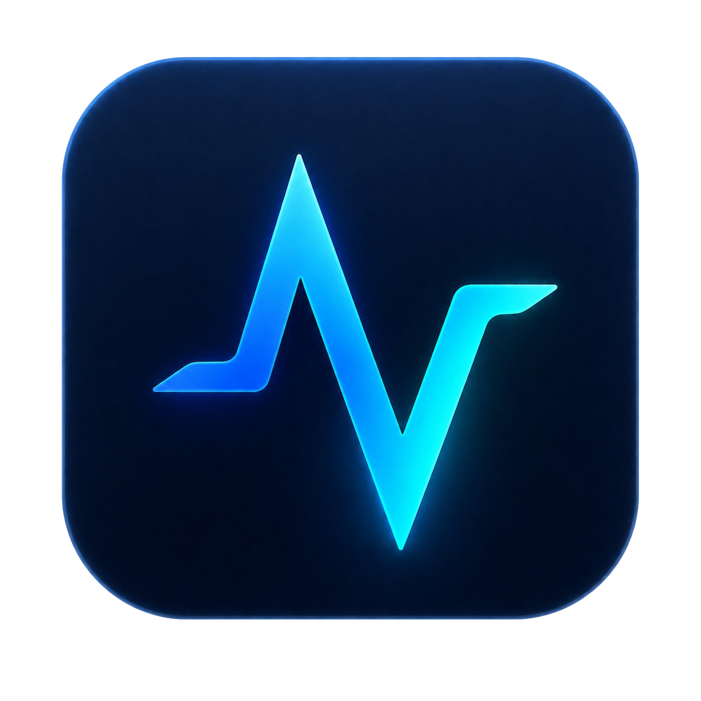
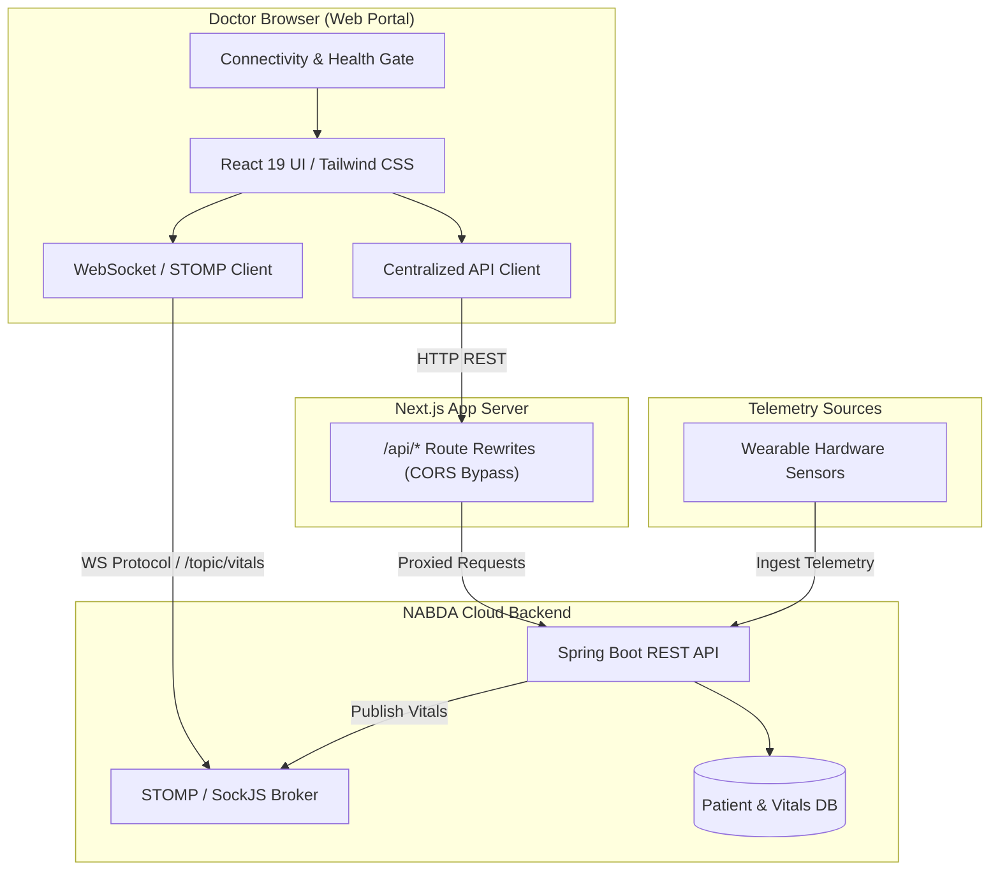

<div align="center">
  
  <h1>NABDA Doctor Web</h1>
  <p><strong>Your Health, Your Pulse</strong> — Clinical Web Portal for Real-Time Cardiovascular Monitoring & AI Diagnostic Support</p>

  [](https://nextjs.org/)
  [](https://react.dev/)
  [](https://www.typescriptlang.org/)
  [](https://tailwindcss.com/)
  [](https://firebase.google.com/)
  [](https://stomp.github.io/)
  [](.github/workflows/ci.yml)
</div>

---

## 📋 Table of Contents

- [Overview](#-overview)
- [System Architecture](#-system-architecture)
- [Key Features](#-key-features)
- [Tech Stack](#-tech-stack)
- [Project Directory Structure](#-project-directory-structure)
- [API & Telemetry Mapping](#-api--telemetry-mapping)
- [Getting Started](#-getting-started)
  - [Prerequisites](#prerequisites)
  - [Installation](#installation)
  - [Environment Variables](#environment-variables)
  - [Running the App](#running-the-app)
- [Verification & Quality Checks](#-verification--quality-checks)
- [Medical Safety Disclaimer](#-medical-safety-disclaimer)
- [Academic Context & Credits](#-academic-context--credits)

---

## 🔍 Overview

**NABDA Doctor Web** is the dedicated web client for healthcare professionals within the **NABDA Ecosystem**. Built with Next.js 15, React 19, and TypeScript, it translates cardiac telemetric data gathered by companion wearable devices into real-time visual insights, continuous vitals streams, and manageable patient workflows.

Designed specifically for desktop and tablet viewports, the platform allows cardiologists and attending physicians to:
- Monitor live vital telemetry (Heart Rate & $SpO_2$) via WebSocket streaming.
- Receive instant alerts when assigned patients transition into `HIGH` or `CRITICAL` risk states.
- Conduct bidirectional 1-to-1 patient communications.
- Review historical AI-assisted diagnostic reports.
- Schedule and manage clinical consultations.

---

## 📐 System Architecture

The web client acts as an intelligent command interface that interfaces directly with the central Spring Boot REST API and STOMP message broker.



---

## ✨ Key Features

| Feature | Description | Status |
| :--- | :--- | :---: |
| **🏥 Clinical Dashboard** | Overview of assigned patient counts, critical alerts, today's appointments, and unread chat queues. | `Active` |
| **👥 Patient Directory** | Searchable patient list with priority badges (`CRITICAL`, `WARNING`, `NORMAL`), patient lookup by phone/name, and assignment controls. | `Active` |
| **📊 Live Vitals Stream** | Real-time SVG chart tracking Heart Rate (BPM) and $SpO_2$ metrics delivered via STOMP WebSocket topics. | `Active` |
| **💬 Doctor-Patient Chat** | Real-time 1-on-1 messaging with delivery/read receipts, typing/presence indicators, and message history. | `Active` |
| **📅 Appointment Manager** | Multi-tab workflow (Upcoming, Completed, Missed, Cancelled) with direct scheduling and status updates. | `Active` |
| **🛡️ AI Assessment View** | Clinical review interface for AI-generated advisory cardiac assessment reports. | `Active` |
| **🔔 Notifications Center** | Paginated system event and alert notifications with batch "Mark as read" functionality. | `Active` |
| **🌐 Offline Recovery Gate** | Auto-detects lost connectivity (`navigator.onLine`) and probes backend health to block invalid state mutations. | `Active` |

---

## 🛠️ Tech Stack

- **Framework:** [Next.js 15 (App Router)](https://nextjs.org/)
- **Library:** [React 19](https://react.dev/)
- **Language:** [TypeScript 5](https://www.typescriptlang.org/)
- **Styling:** [Tailwind CSS 3](https://tailwindcss.com/) & Vanilla CSS Tokens
- **Real-time Protocol:** STOMP over SockJS ([@stomp/stompjs](https://github.com/stomp-js/stompjs))
- **Auth Provider:** [Firebase Auth](https://firebase.google.com/) (Google OAuth) + Custom JWT
- **Design Tokens:** Material Symbols Rounded, Roboto (EN), Cairo (AR/RTL support)

---

## 📁 Project Directory Structure

```text
gp-web-app/
├── .github/
│   └── workflows/
│       └── ci.yml               # Automated CI check (typecheck, lint, build)
├── public/
│   ├── brand/                   # Brand assets, logos, and icons
│   └── favicons/                # Favicon bundle across resolutions
├── src/
│   ├── app/                     # Next.js App Router pages
│   │   ├── appointments/        # Appointment management views
│   │   ├── chats/               # Real-time chat & thread pages
│   │   ├── dashboard/           # Doctor main monitoring center
│   │   ├── login/               # Doctor authentication page
│   │   ├── notifications/       # Notification hub
│   │   ├── patients/            # Patient list, vitals & AI report history
│   │   ├── profile/             # Profile & preferences management
│   │   └── settings/            # App preferences & settings
│   ├── components/              # Modular UI components
│   │   ├── layout/              # Protected shell, sidebar & connectivity gate
│   │   └── ui/                  # Buttons, modals, cards, badges, chart elements
│   ├── context/                 # Auth & global application state
│   ├── services/                # Core service integrations
│   │   ├── apiClient.ts         # Centralized REST client
│   │   ├── connectivity.ts      # Internet & backend health probe service
│   │   ├── firebaseAuth.ts      # Firebase Auth helpers
│   │   ├── storage.ts           # Token & local session persistence
│   │   └── websocket.ts         # STOMP WebSocket connection manager
│   ├── types/                   # TypeScript interfaces matching backend models
│   └── utils/                   # Formatting, date helpers & constants
├── .env.example                 # Environment variables specification
├── next.config.ts               # Proxy rewrites & Next.js config
└── package.json                 # Node dependencies and project scripts
```

---

## 🔄 API & Telemetry Mapping

The web app strictly consumes doctor-scoped endpoints matching the platform specifications:

| Domain | REST Endpoint / WS Topic | HTTP / Event | Purpose |
| :--- | :--- | :---: | :--- |
| **Auth** | `/api/auth/login` | `POST` | Doctor JWT Authentication |
| **Auth** | `/api/user/me` | `GET` / `PUT` | Fetch & Update Doctor Profile |
| **Patients** | `/api/doctor/patients/{doctorId}` | `GET` | Retrieve Assigned Patients List |
| **Patients** | `/api/doctor/assign` | `POST` | Assign Patient to Doctor |
| **Patients** | `/api/doctor/remove` | `DELETE` | Remove Patient Assignment |
| **Vitals** | `/api/iot/latest/{patientId}` | `GET` | Read Latest Vitals Snapshot |
| **Vitals** | `/api/iot/summary/hourly/{patientId}` | `GET` | Hourly Aggregate Vitals Summaries |
| **Realtime Vitals** | `/topic/vitals/{doctorId}` | `STOMP` | Live Vitals Stream Subscription |
| **Chat** | `/api/chat/history/{u1}/{u2}` | `GET` | Load Message Thread |
| **Realtime Chat** | `/topic/chat/{receiverId}` | `STOMP` | Live Message Reception |
| **Appointments**| `/api/appointments/doctor/{doctorId}` | `GET` | Fetch Doctor's Schedule |
| **AI Reports** | `/api/ai/history/{patientId}` | `GET` | Read-only AI Assessment History |

---

## 💻 Getting Started

### Prerequisites

- **Node.js**: `v18.x` or `v20.x` recommended
- **npm**: `v9.x` or higher

### Installation

1. Clone the repository:
   ```bash
   git clone https://github.com/Nabda-Project/gp-web-app.git
   cd gp-web-app
   ```

2. Install dependencies:
   ```bash
   npm install
   ```

### Environment Variables

Create a `.env.local` file by copying [.env.example](.env.example):

```bash
cp .env.example .env.local
```

Fill in the required configuration:

```env
# Backend API & WebSocket Config
NEXT_PUBLIC_API_URL=/api
BACKEND_API_URL=http://smart-medical-api-env.eba-jxdmccmi.us-east-1.elasticbeanstalk.com/api
NEXT_PUBLIC_WS_HOST=smart-medical-api-env.eba-jxdmccmi.us-east-1.elasticbeanstalk.com

# Firebase Web App Config (Google Sign-In)
NEXT_PUBLIC_FIREBASE_API_KEY=your_firebase_api_key
NEXT_PUBLIC_FIREBASE_AUTH_DOMAIN=your_project.firebaseapp.com
NEXT_PUBLIC_FIREBASE_PROJECT_ID=your_project_id
NEXT_PUBLIC_FIREBASE_APP_ID=your_app_id
NEXT_PUBLIC_FIREBASE_MESSAGING_SENDER_ID=your_sender_id
NEXT_PUBLIC_FIREBASE_STORAGE_BUCKET=your_bucket.appspot.com
```

> **Note on CORS:** Requests directed to `NEXT_PUBLIC_API_URL=/api` are proxied by Next.js in [next.config.ts](next.config.ts) directly to `BACKEND_API_URL`. This completely prevents cross-origin requests issues during local development.

### Running the App

Start the development server:
```bash
npm run dev
```

Navigate to [http://localhost:3000](http://localhost:3000) in your web browser.

---

## 🧪 Verification & Quality Checks

Run the continuous integration checks locally prior to committing:

```bash
# Type check TypeScript definitions
npm run typecheck

# Validate code style & rules with ESLint
npm run lint

# Verify production build compilation
npm run build
```

These checks run automatically on GitHub Actions for every pull request and push to `main` via [.github/workflows/ci.yml](.github/workflows/ci.yml).

---

## ⚠️ Medical Safety Disclaimer

> [!IMPORTANT]
> **Advisory Use Notice:** AI-assisted assessments, cardiac metrics, and threshold alerts within the NABDA platform are designed as clinical decision-support tools only. They do not constitute diagnostic medical advice or replace professional diagnostic workflows. Attending healthcare professionals maintain full responsibility for verifying telemetric data before making treatment decisions.

---

## 🎓 Academic Context & Credits

This application was developed as part of the **Senior Graduation Project** at **Alexandria University**, Faculty of Engineering, Department of Communication & Electronics.

- **Project Title:** NABDA – Connected Cardiovascular Telemetry & AI Diagnostic Portal
- **Academic Supervisor:** Dr. Aida El-Shafie
- **Department:** Communication & Electronics Engineering
- **Institution:** Alexandria University
